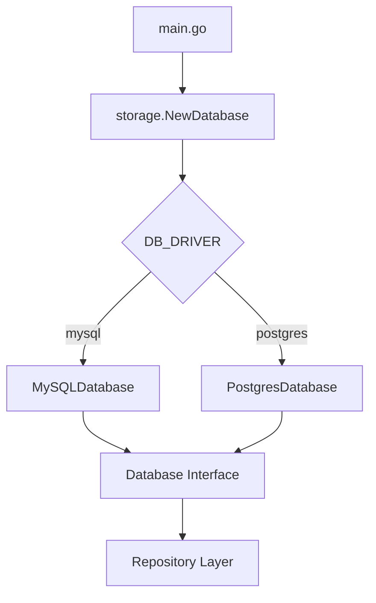

# Storage Layer Architecture

Tài liệu mô tả kiến trúc tầng storage của ứng dụng.

## Overview

```
internal/adapter/storage/
├── database.go          # Interface & Factory
├── mysql_adapter.go     # MySQL implementation
├── postgres_adapter.go  # PostgreSQL implementation
└── mysql/
    ├── dbgen/           # SQLC generated code
    ├── user_repository.go
    ├── token_repository.go
    └── migrator.go
```

## Design Pattern: Factory Pattern



## Core Interface

```go
// Database is the common interface for all SQL databases
type Database interface {
    GetDB() *sql.DB       // Returns raw connection
    Close() error         // Closes connection
    RunMigrations() error // Runs migrations
    DriverName() string   // Returns driver name
}
```

## Repository Pattern

Repositories implement port interfaces defined in `internal/core/port/`:

```go
// Port (Interface)
type UserRepository interface {
    GetByID(ctx context.Context, id int64) (*domain.User, error)
    Create(ctx context.Context, user *domain.User) error
    // ...
}

// Adapter (Implementation)
type UserRepository struct {
    db      *sql.DB
    queries *dbgen.Queries  // SQLC generated
}
```

## Data Flow

```
HTTP Handler
    ↓
Service (Business Logic)
    ↓
Repository Interface (Port)
    ↓
Repository Implementation (Adapter)
    ↓
Database Interface
    ↓
MySQL/PostgreSQL Driver
```

## Configuration

Database config is loaded separately via `config.LoadDatabaseOnly()`:

| ENV Variable | Description | Default |
|--------------|-------------|---------|
| `DB_DRIVER` | Database driver | `mysql` |
| `DB_HOST` | Database host | `localhost` |
| `DB_PORT` | Database port | `3306` |
| `DB_USER` | Database user | `root` |
| `DB_PASSWORD` | Database password | - |
| `DB_NAME` | Database name | `test` |
| `DB_SSLMODE` | SSL mode (postgres) | - |
